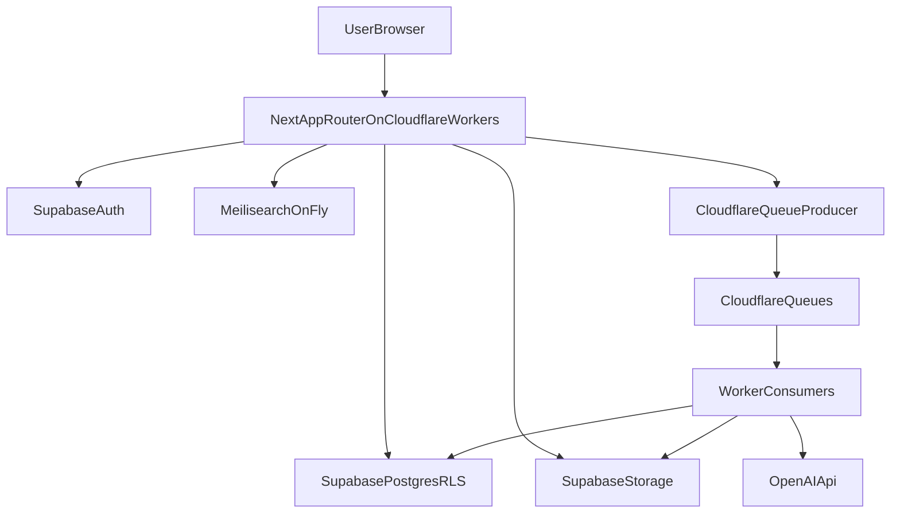

# ConnectPlate Implementation Plan

## 0) Goal and Scope

Build `ConnectPlate` as a diet-focused, community recipe platform using the existing Next.js + Supabase starter as baseline auth/data infrastructure, then incrementally add community features, search, AI conversion, and background processing in production-safe phases.

Primary constraints:

- Runtime target: OpenNext on Cloudflare Workers (not deprecated Next-on-Pages).
- Async processing: Cloudflare Queues for long-running tasks (LLM conversion and PDF generation).
- Search: Meilisearch hosted on Fly.io with persistent volume.
- Security: Supabase RLS-first data model and private service credentials only on server/worker paths.

## 1) Project Overview (Course Proposal Section)

`ConnectPlate` helps home cooks discover and share recipes that satisfy dietary needs (e.g., low sodium, gluten-free) while fostering community interactions (follow users, save recipes, browse feed).

User experiences:

- Unauthenticated: marketing-style home page, searchable public recipes with dietary filters, read-only recipe details.
- Authenticated: personalized feed (followed users), profile and settings management, saved recipes, AI dietary conversion requests, and PDF export requests.

## 2) Planned Features and Tasks (Course Proposal Section)

### A. Frontend (Next.js App Router + Tailwind)

- Build route groups and pages for:
  - Public: `/`, `/recipes`, `/recipes/[id]`.
  - Authenticated: `/feed`, `/dashboard`, `/profile/[username]`, `/settings`, `/saved`.
- Add reusable components in existing structure:
  - Recipe cards, dietary filter chips, search input, follow button, save button, conversion modal, PDF status chip.
- Implement loading/error states per route (`loading.tsx`, `error.tsx`) and optimistic UI for follow/save actions.
- Accessibility and responsive-first implementation:
  - Keyboard navigable controls, visible focus states, WCAG contrast checks, ARIA labels for dynamic controls.

### B. Backend/API (Route Handlers)

- Implement route handlers under `app/api/` for:
  - Recipe CRUD.
  - Follow/unfollow.
  - Save/unsave recipes.
  - Search proxy to Meilisearch.
  - Queue producers: `convert-recipe` and `generate-pdf`.
- Add strict input validation and auth guards for each endpoint.
- Ensure all writes use server-side Supabase client and enforce ownership checks.

### C. Database (Supabase + RLS)

- Extend schema with normalized tables for users, recipes, social graph, saved recipes, tags, and job tracking.
- Add migration-driven constraints, indexes, and RLS policies.
- Add denormalized read columns only where needed for feed/search performance.

### D. Background Processing (Cloudflare Queues + Workers)

- Queue 1: dietary conversion jobs (OpenAI call + output persistence).
- Queue 2: PDF generation jobs (render + store in Supabase Storage + signed/public URL handling).
- Add dead-letter/error handling and retry policy.
- Store job lifecycle states in DB (`queued`, `processing`, `succeeded`, `failed`).

### E. Search (Meilisearch on Fly.io)

- Provision Meilisearch with persistent volume and secured API key.
- Define recipe index schema, searchable/filterable/sortable attributes.
- Build incremental sync process (on recipe create/update/delete).

## 3) Technical Requirements and Technology Choices (Course Proposal Section)

- Web app: Next.js App Router.
- Hosting/runtime: OpenNext deployed to Cloudflare Workers.
- Database/Auth/Storage: Supabase Postgres + Auth + Storage + RLS.
- Background worker requirement: Cloudflare Queues consumers for async LLM/PDF tasks.
- LLM requirement: OpenAI integration for dietary conversions with guardrails.
- New technologies (at least two):
  - OpenNext for Cloudflare deployment path.
  - Meilisearch (hosted on Fly.io persistent volume).
  - Cloudflare Queues (additional new infra).

## 4) New Knowledge and Open Questions (Course Proposal Section)

Learning topics:

- OpenNext build/deploy flow and Cloudflare bindings.
- Queue architecture on Cloudflare (producer/consumer/retries/DLQ).
- Meilisearch relevance tuning and index sync design.
- Prompt and output validation strategies for reliable recipe conversion.

Primary risks and mitigations:

- LLM output quality risk -> strict schema validation + fallback messaging + human-readable diff of changed steps.
- API/runtime compatibility risk on edge -> avoid Node-only modules in route handlers/workers.
- Search cost/operations risk -> constrain indexed fields, monitor usage, and predefine volume limits on Fly.
- Migration safety risk -> keep migration workflow manual/protected and environment-scoped.

## 5) Sequential Implementation Phases

### Phase 1 — Foundation Hardening and Rebrand

Scope:

- Finalize branding strings/colors/theme tokens and remove remaining starter wording.
- Keep migration workflow manual.
- Confirm local and remote env separation.

Deliverables:

- Brand baseline in UI metadata/header/home messaging.
- Updated `tailwind` theme tokens and CSS variables for accessible palette.

Key files:

- `/home/talia/connectplate/app/layout.tsx`
- `/home/talia/connectplate/components/header/Header.tsx`
- `/home/talia/connectplate/app/globals.css`
- `/home/talia/connectplate/tailwind.config.ts`
- `/home/talia/connectplate/.github/workflows/migrate.yml`

### Phase 2 — Data Model and RLS Design

Scope:

- Define full relational model and policies before building features.

Tables (minimum):

- `profiles` (extend existing): `id`, `username`, `display_name`, `bio`, `avatar_url`.
- `recipes`: `id`, `author_id`, `title`, `ingredients_json`, `instructions_json`, `nutrition_json`, `visibility`, timestamps.
- `dietary_tags`: canonical tags (`gluten_free`, `low_sodium`, etc.) and metadata.
- `recipe_tags`: many-to-many join.
- `follows`: `follower_id`, `followee_id`.
- `saved_recipes`: `user_id`, `recipe_id`.
- `recipe_conversion_jobs`: status/result/error metadata.
- `recipe_pdf_jobs`: status/storage path/error metadata.

RLS goals:

- Public read for `public` recipes.
- Owner-only recipe edit/delete.
- Auth-only follow/save with self-protection constraints.
- Job rows visible to requesting user and service roles/worker integrations only.

Deliverables:

- Declarative schema updates + generated migrations + indexes + policies.

Key files:

- `/home/talia/connectplate/supabase/schemas/*.sql`
- `/home/talia/connectplate/supabase/migrations/*`

### Phase 3 — Public Recipe Discovery MVP

Scope:

- Build public browse/search/filter pages and recipe detail page.

Tasks:

- Create `/recipes` with keyword + dietary filters.
- Create `/recipes/[id]` detail view with ingredient/instruction rendering.
- Implement server-side data fetchers and pagination.

Deliverables:

- Non-authenticated user can discover and read public recipes.

Key files:

- `/home/talia/connectplate/app/recipes/page.tsx`
- `/home/talia/connectplate/app/recipes/[id]/page.tsx`
- `/home/talia/connectplate/components/*recipe*`
- `/home/talia/connectplate/lib/*`

### Phase 4 — Authenticated Community Features

Scope:

- Add follow graph, feed, save flows, and profile settings.

Tasks:

- Follow/unfollow action endpoints + UI.
- Saved recipes endpoint + dashboard section.
- Feed query joining followed users’ public recipes.
- Profile page improvements (`username`, `bio`, avatar, counts).

Deliverables:

- Signed-in users can personalize content and interactions.

Key files:

- `/home/talia/connectplate/app/feed/page.tsx`
- `/home/talia/connectplate/app/dashboard/page.tsx`
- `/home/talia/connectplate/app/profile/*`
- `/home/talia/connectplate/app/api/*`

### Phase 5 — Search Infrastructure (Meilisearch)

Scope:

- Integrate recipe indexing and query path.

Tasks:

- Provision Fly app + persistent volume + secrets.
- Define index settings:
  - Searchable: title, ingredients text, instructions text.
  - Filterable: dietary tags, author id, visibility.
  - Sortable: created_at, popularity score (later).
- Build sync hooks from recipe mutations to Meilisearch.

Deliverables:

- Fast typo-tolerant full-text search with dietary filters.

Key files:

- `/home/talia/connectplate/app/api/search/route.ts`
- `/home/talia/connectplate/lib/search/*`

### Phase 6 — Queue-Based AI Dietary Conversion (OpenAI MVP)

Scope:

- Build async conversion pipeline with persistent result tracking.

Flow:

1. UI submits conversion request (recipe id + target diet).
2. API validates ownership/access and enqueues job.
3. Queue consumer fetches recipe, calls OpenAI, validates response schema, stores converted recipe variant.
4. UI polls/subscribes to job status and displays result/diff.

Guardrails:

- Structured output schema (JSON only).
- Reject unsafe/invalid conversions.
- Never store hidden reasoning; persist only final transformed content and rationale summary.

Deliverables:

- Reliable conversion pipeline that avoids edge timeouts.

Key files:

- `/home/talia/connectplate/app/api/recipes/[id]/convert/route.ts`
- `/home/talia/connectplate/lib/llm/*`
- `/home/talia/connectplate/workers/*`

### Phase 7 — Queue-Based PDF Generation

Scope:

- Generate downloadable recipe PDFs asynchronously.

Flow:

1. User requests PDF from recipe page.
2. API enqueues PDF job.
3. Worker renders PDF, uploads to Supabase Storage, updates job row.
4. UI shows completion and download link.

Deliverables:

- Scalable PDF generation without blocking request lifecycle.

Key files:

- `/home/talia/connectplate/app/api/recipes/[id]/pdf/route.ts`
- `/home/talia/connectplate/lib/pdf/*`
- `/home/talia/connectplate/workers/*`

### Phase 8 — Cloudflare Deployment with OpenNext

Scope:

- Configure production deployment and bindings.

Tasks:

- Add OpenNext build/deploy config.
- Configure Cloudflare env vars/bindings (queues, secrets).
- Verify route handlers and middleware behavior on worker runtime.

Deliverables:

- Repeatable deploy pipeline to Cloudflare Workers via OpenNext.

Key files:

- `/home/talia/connectplate/open-next.config.ts` (or equivalent)
- `/home/talia/connectplate/wrangler.toml`
- `/home/talia/connectplate/package.json`

### Phase 9 — Design System and Accessibility Pass

Scope:

- Convert provided palette to semantic design tokens and enforce accessibility.

Initial palette candidates:

- lilac `#c387d5`
- plum `#734382`
- lavender `#e4cdeb`
- charcoal `#2E2E2E`
- gray `#e2e0e0`
- white `#ffffff`

Tasks:

- Map to semantic tokens (`primary`, `secondary`, `surface`, `muted`, `focus`, `danger`).
- Validate contrast for text/button/focus states in light/dark themes.
- Tailwind utilities for consistent spacing, elevation, and states.

Deliverables:

- Accessible, cohesive UI foundation used across all feature pages.

Key files:

- `/home/talia/connectplate/app/globals.css`
- `/home/talia/connectplate/tailwind.config.ts`
- `/home/talia/connectplate/components/ui/*`

### Phase 10 — Observability, Testing, and Launch Readiness

Scope:

- Add tests and operational readiness checks.

Tasks:

- Unit tests for auth guards, API validators, queue payload shaping.
- Integration tests for recipe CRUD, follow/save, and job status transitions.
- Error monitoring/logging strategy for workers and route handlers.
- Seed script and demo data for grading/demo.

Deliverables:

- Stable MVP with documented test plan and known limitations.

Key files:

- `/home/talia/connectplate/lib/**/*.test.ts*`
- `/home/talia/connectplate/app/api/**/*.test.ts*`
- `/home/talia/connectplate/STARTER-CODE-README.md` (reference only until new README is authored)

## 6) Architecture Diagram (High Level)

## 7) Milestones and Exit Criteria

- Milestone A: Public recipe browse/search works with seeded data.
- Milestone B: Authenticated social features (follow/save/feed/profile) complete with RLS.
- Milestone C: AI conversion queue is reliable and returns validated transformed recipes.
- Milestone D: PDF queue produces downloadable files in storage.
- Milestone E: OpenNext deployment live on Cloudflare with monitoring and test coverage baseline.

Exit criteria for “course-ready MVP”:

- Meets all assignment technical requirements (database, background worker, LLM, new technologies, web app).
- Demonstrates complete unauthenticated and authenticated flows.
- Includes deployment path, test evidence, and documented known risks/tradeoffs.
